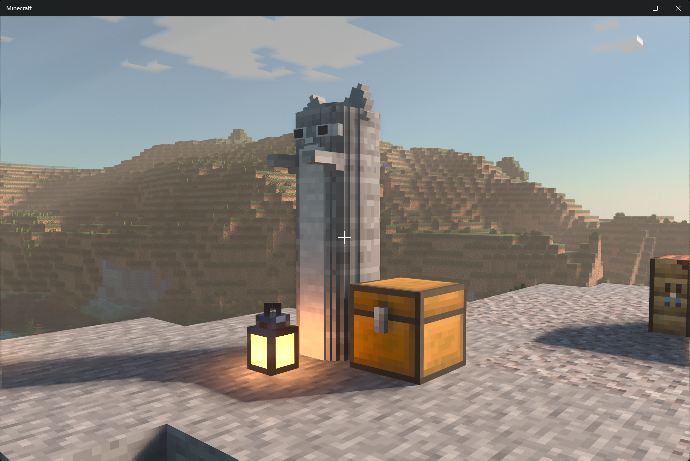
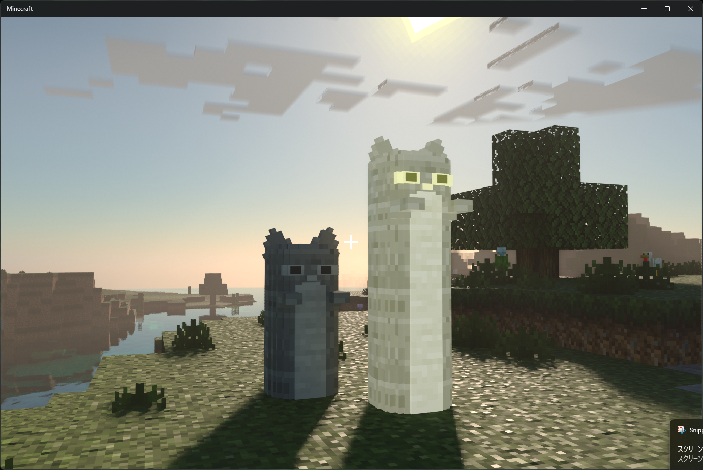

# Minecraft Addon - Cat Statue

猫の石像を追加するマインクラフト統合版向けのアドオンです。

このアドオンは以下のような機能を追加します。
- 猫の石像は初回スポーン位置に生成されます
- 猫の石像は一定の確率でオーバーワールド上に生成されます
- 高さ3ブロック以上の石像の近くでしゃがむと「猫の石像トークン」が手に入ります
- 「猫の石像トークン」は燃料になります
- 「猫の石像トークン」を9つクラフトすると「圧縮された猫の石像トークン」が手に入ります
- 「猫の石像トークン」は石炭と同じ燃焼時間の燃料になります
- 「圧縮された猫の石像トークン」は石炭ブロックと同じ燃焼時間の燃料になります
- 「猫の石像トークン」と火打ち石を斜めにクラフトすると「猫の石像の彫刻刀」が手に入ります
- 「猫の石像の彫刻刀」を石や深層岩に利用すると猫の石像を作れます
- 猫の石像の頭に松明を使用すると石像が光るようになります
- 光る石像は明るさ15の光源ブロックになります
- 石像の光はRTXに対応しています
